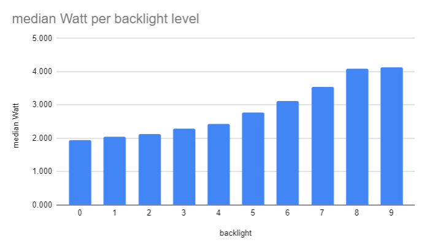
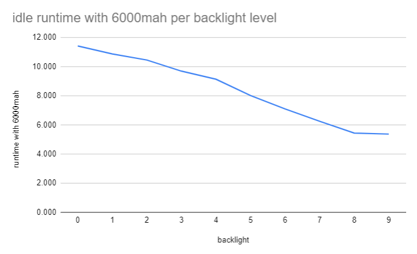
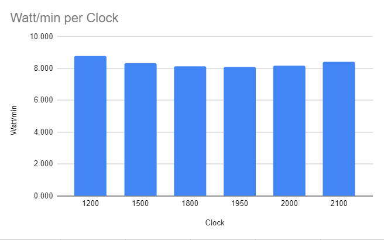
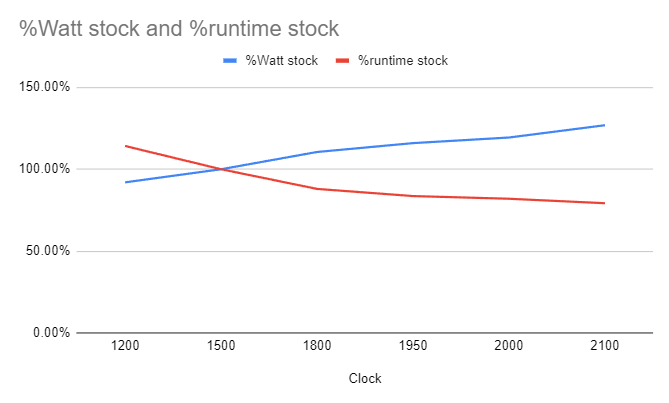
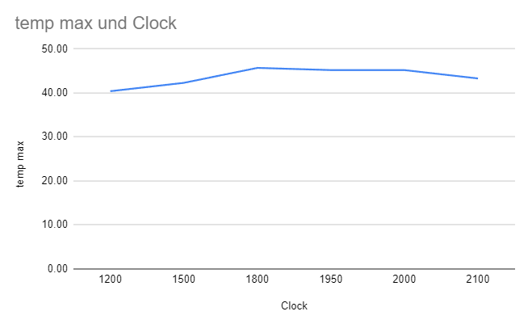

# uConsole Power usage

I ran some stastistics to see how backlight level, wifi, bluetooth and over/underclocking affect the power usage and projected runtime of my uconsole with the raspberry pi CM4 module.

Below you'll find an overview of the benchmarks I ran. In the stats subdirectory you'll find all the raw data taken. All data with graphs are also available in [Google Docs](https://docs.google.com/spreadsheets/d/1pOxwXdjOGgtJILX_jXlkyKt9TFnzl48nyjTw3aHt3zE/edit?usp=sharing)

*WARNING:*
*I'm not a statistics guy and this is the first time that I'm doing some detailed power usage benchmarks (other then eyball them) so take the numbers with a grain of salt*

And if you find any problem in my methology, calculation or graphs please tell me.

## Backlight
The display/backlight is, as for all mobile devices, the most power hungry component. If you want your uConsole to last long, turn down the backlight as much as possible.

To mesure the power draw I ran the uConStat tool for 1 minute with wifi and bluetooth off in idle on all 10 levels.

| backlight | median Watt | runtime with 6000mah |
| --------- | ----------- | -------------------- |
| 0         | 1.944       | 11.418               |
| 1         | 2.042       | 10.873               |
| 2         | 2.124       | 10.454               |
| 3         | 2.290       | 9.692                |
| 4         | 2.430       | 9.136                |
| 5         | 2.770       | 8.014                |
| 6         | 3.127       | 7.100                |
| 7         | 3.551       | 6.252                |
| 8         | 4.082       | 5.439                |
| 9         | 4.133       | 5.371                |

backlight 0 menas off 9 is maximum brightness.

`runtime with 6000mah` is the projected runtime in hours idle with two 3000mah batteries

## wifi and bluetooth
wifi and bluetooth don't seem to impact the power cosumtion much (or at all).

To mesure the power draw I ran the uConStat tool for 1 minute with wifi and bluetooth on/off on idle.

| wifi | bt  | median Watt |
| ---- | --- | ----------- |
| off  | off | 1.944       |
| off  | on  | 1.942       |
| on   | off | 1.941       |
| on   | on  | 1.998       |

## over/under clocking the CPU
You can over/underclock the cpu by tweaking the `arm_freq` setting in `/boot/config.txt`
stock is 1500 (mhz) and max is around 2200 (depending on your CPU) you can also set it lower then stock (I tried 1200)

You can over/undervolt the cpu by tweaking the `over_voltage` setting in `/boot/config.txt` for higher clock settings you have to overvolt. You can set the voltage in levels `0` is stock positive numbers increase the voltage negative decrease the voltage.

You can find more information in the raspberry pi [documentation](https://www.raspberrypi.com/documentation/computers/config_txt.html#overclocking-options)

*WARNING:*
*Overclocking voids your warrenty*

If you uConsole does not boot you can just forcefully turn it off by holding the power button for over 10 sec and then change the settings in /boot/config.txt on any other computer with a cardreader.

### settings I used for benchmarking
| arm_freq | over_voltage | comment                                                  |
| -------- | ------------ | -------------------------------------------------------- |
| 1200     | -2           | the only underclock/undervolt I tried so far             |
| 1500     | 0            | stock settings                                           |
| 1800     | 2            | first overclock I tried, did not try with other voltages |
| 1950     | 3            | would not boot with over_voltage 2                       |
| 2000     | 4            | would not run stable with over_voltage 3                 |
| 2100     | 5            | would not boot with over_voltage 4                       |
| 2200     | 6            | would not run stable didn't try to overvolt more         |

### power consumtion in idle

For this test I over/underclocked the CPU and lat it run idel for 60 seconds with display, wifi and bluetooth off. I don't know why the underclock/undervolt consumed more power then stock. I reran the benchmark can got the same numbers.

| Clock | median Watt | runtime with 6000mah |
| ----- | ----------- | -------------------- |
| 1200  | 1.894       | 11.72                |
| 1500  | 1.944       | 11.42                |
| 1800  | 2.045       | 10.86                |
| 1950  | 2.080       | 10.67                |
| 2000  | 2.134       | 10.40                |
| 2100  | 2.242       | 9.90                 |

`runtime with 6000mah` is the projected runtime in hours idle with two 3000mah batteries

### power consumtion with workload

To test the power consumtion I let the stats run in the background with wifi, bluetooth and display off while compiling a [zig project](https://github.com/SuSonicTH/zli) of mine. 
The compilation is CPU bound and uses some multithreading but not for the whole build and runs for around 2 minutes on the uConsole.

This was done to ensure stability, get power consumtion and temperatures.

| Clock | Median Watt | runtime | %Watt stock | %runtime stock | runtime with 6000mah |
| ----- | ----------- | ------- | ----------- | -------------- | -------------------- |
| 1200  | 2.521       | 209     | 91.99%      | 114.21%        | 8.807                |
| 1500  | 2.740       | 183     | 100.00%     | 100.00%        | 8.102                |
| 1800  | 3.029       | 161     | 110.54%     | 87.98%         | 7.329                |
| 1950  | 3.178       | 153     | 115.96%     | 83.61%         | 6.987                |
| 2000  | 3.271       | 150     | 119.39%     | 81.97%         | 6.786                |
| 2100  | 3.477       | 145     | 126.90%     | 79.23%         | 6.384                |

Power usage and performance almost scale linear. But for me the sweetspot is at 1950 where the performance/watt seems to be the best. That's the setting i'm currently running on and I did'nt encounter any problems so far. The cooling seems sufficient even for high overclocks as I din't see any temperatures over 45°C

